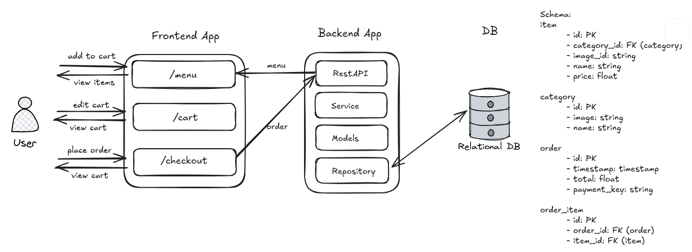
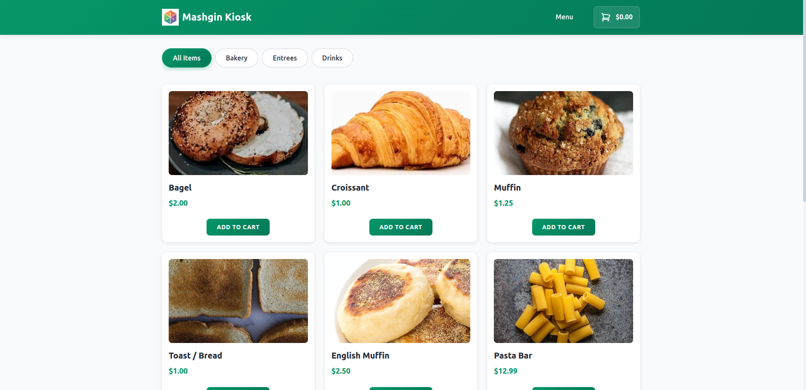
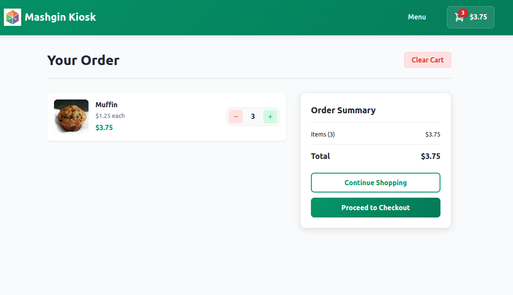
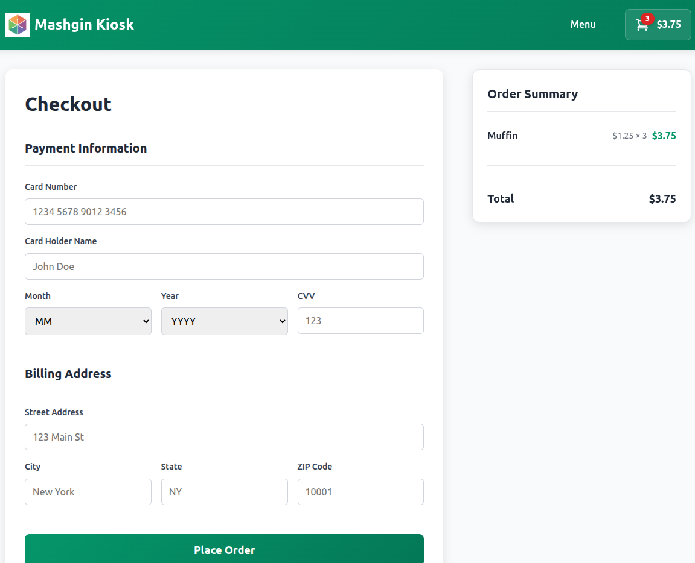

# Kiosk Checkout System

This project is a full-stack kiosk checkout system, featuring a React frontend and a Python FastAPI backend. It's designed to simulate a self-service kiosk where customers can browse a menu, add items to their cart, and "pay" for their order.



Some assumptions:

- Users are not identified and we don't hold their history
- Carts are ephemeral, we only care about them during the user session

Out of scope:

- Authorization and authentication
- Metrics and improved observability


## Screenshots






## Features

- **Menu Display**: Browse menu items categorized for easy navigation.
- **Shopping Cart**: Add/remove items and update quantities.
- **Simple Checkout**: Simulate a payment and complete the order.
- **RESTful API**: A robust backend serving menu items and handling orders.
- **Dockerized Environment**: Easy setup and deployment with Docker Compose.

## Tech Stack

- **Frontend**: React, CSS Modules
- **Backend**: Python, FastAPI
- **Database**: SQLite
- **Containerization**: Docker, Docker Compose

## Project Structure

The project is organized into two main parts:

-   `frontend/`: Contains the React application.
-   `backend/`: Contains the Python FastAPI application.

```
.
├── backend/                # Python FastAPI Backend
│   ├── checkout/           # Main application module
│   ├── tests/              # Backend tests
│   ├── Dockerfile
│   └── requirements.txt
├── frontend/               # React Frontend
│   ├── public/
│   ├── src/                # Source files
│   ├── Dockerfile
│   └── package.json
├── docker-compose.yml      # Docker Compose configuration
├── Makefile                # Helper commands
└── Readme.md               # This file
```

## Prerequisites

Make sure you have the following installed on your local machine:

-   [Node.js](https://nodejs.org/en/) (v14 or newer)
-   [Python](https://www.python.org/downloads/) (v3.9 or newer)
-   [Docker](https://www.docker.com/get-started) and [Docker Compose](https://docs.docker.com/compose/install/)

## Getting Started

You can run this project in two ways: using Docker (recommended for ease of use) or running the frontend and backend separately on your local machine.

### Using Docker (Recommended)

This is the simplest way to get the entire application running.

1.  **Build and Run the Application:**
    This single command will build the Docker images, start the containers, and seed the database with initial menu items.

    ```bash
    make docker-run
    ```

2.  **Access the Application:**
    -   **Frontend**: Open your browser and go to [http://localhost:3000](http://localhost:3000)
    -   **Backend API Docs**: Go to [http://localhost:8000/docs](http://localhost:8000/docs)

3.  **Stopping the Application:**
    To stop the containers, run:
    ```bash
    make docker-down
    ```

### Running Locally

Follow these steps to run the frontend and backend services separately.

#### Backend Setup

1.  **Create a virtual environment and install dependencies:**

    ```bash
    make setup
    ```

2.  **Activate the virtual environment:**
    *This project was developed and tested using a venv virtual environment. If you are using a different environment manager, such as Conda, please adapt the activation command accordingly.*

    ```bash
    source backend/venv/bin/activate
    ```

3.  **Seed the database:**
    This command populates the database with menu items.

    ```bash
    make seed
    ```

4.  **Run the backend server:**

    ```bash
    make run-backend
    ```

    The API will be available at `http://localhost:8000`.

#### Frontend Setup

1.  **Navigate to the frontend directory and install dependencies:**

    ```bash
    cd frontend
    npm install
    ```

2.  **Run the frontend development server:**

    ```bash
    npm start
    ```

    The React application will be available at `http://localhost:3000`.

## API Documentation

With the backend running, you can access the interactive API documentation (provided by Swagger UI) at:

[http://localhost:8000/docs](http://localhost:8000/docs)

## Testing

To run the backend tests, make sure you have set up the local environment and installed the dependencies.

```bash
make test-backend
```
